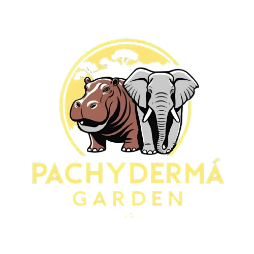
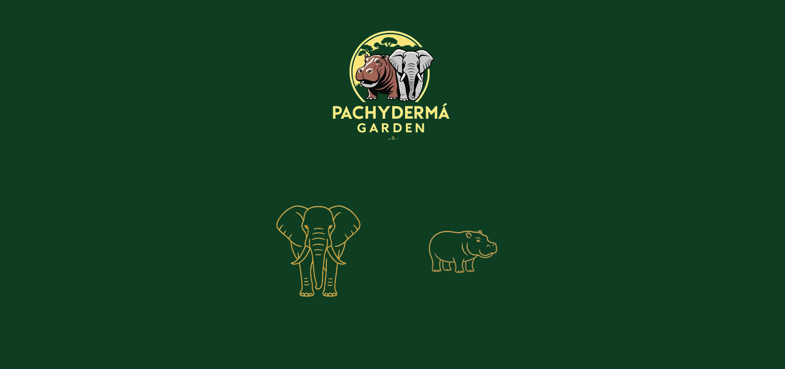
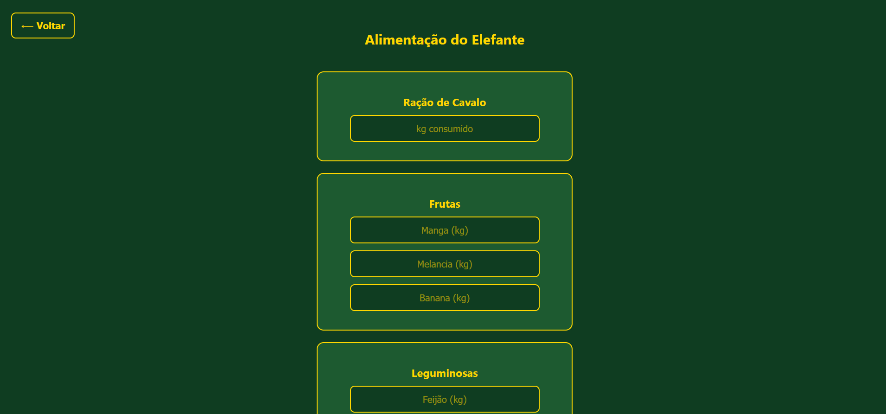
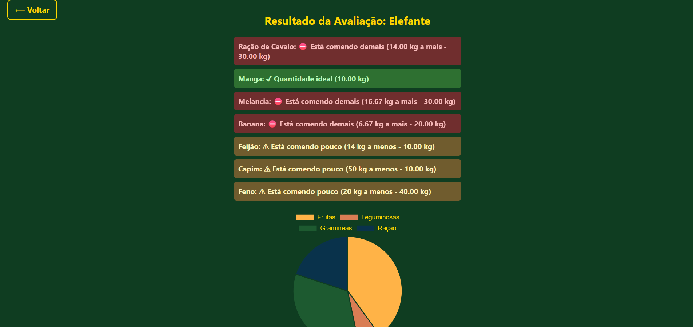

<p align="center">
  
</p>

<h1 align="center">🌿 Reserva Pachyderma</h1>
<h3 align="center">Sistema de Avaliação Nutricional para Hipopótamos e Elefantes</h3>
<h4 align="center">https://reserva-pachyderma.vercel.app/</h4>

---

## 🧠 Sobre o Projeto

Este projeto foi desenvolvido para apoiar o grupo de **Medicina Veterinária da UNI BH** na avaliação diária da dieta de **hipopótamos e elefantes** da Reserva Pachyderma.

O sistema permite registrar os alimentos oferecidos aos animais e avaliar visualmente se estão consumindo as quantidades ideais, com base em diretrizes nutricionais que podem ser ajustadas ao longo do tempo.

---

## 📷 Imagens do Sistema

### Tela Inicial


### Informação de Animal


### Avaliação Nutricional


---

## ⚙️ Funcionalidades

- 🐘 **Seleção entre elefante ou hipopótamo**
- 🧾 **Preenchimento dos alimentos consumidos**
- 📊 **Relatório com análise visual (cores e mensagens claras)**
- 🥗 **Gráfico de pizza com distribuição dos grupos alimentares**
- 🔄 **Botões para voltar ou alterar valores preenchidos**

---

## 🖥️ Tecnologias Utilizadas

- HTML5 + CSS3
- JavaScript Puro (Vanilla)
- [Chart.js](https://www.chartjs.org/) para geração dos gráficos

---

## 🚀 Como Executar

1. Clone este repositório:
   ```bash
   git clone https://github.com/seuusuario/reserva-pachyderma.git
   ```
2. Acesse a pasta do projeto:
   ```bash
   cd reserva-pachyderma
   ```
3. Abra o arquivo `index.html` em seu navegador favorito.

> 💡 O projeto não requer backend nem instalação de dependências — é totalmente executável localmente.

---

## 🧑‍🔬 Público-Alvo

Este sistema foi idealizado em parceria com a equipe de **Medicina Veterinária da UNI BH** e pode ser adaptado para outras espécies ou unidades de manejo animal.

---

## ✨ Créditos

Desenvolvido por Davi Mendes em colaboração com a equipe veterinária da **UNI BH** 🧑‍⚕️🐘🦛

---

<p align="center">
  <strong>🌿 Reserva Pachyderma — Tecnologia a favor do bem-estar animal</strong>
</p>
